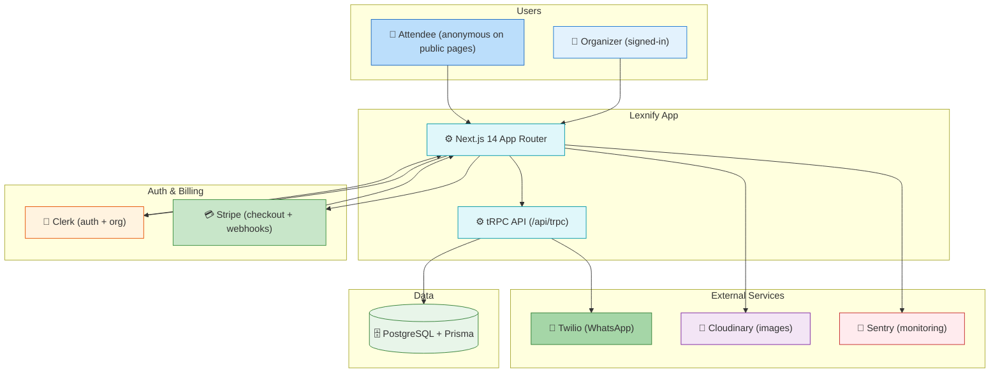
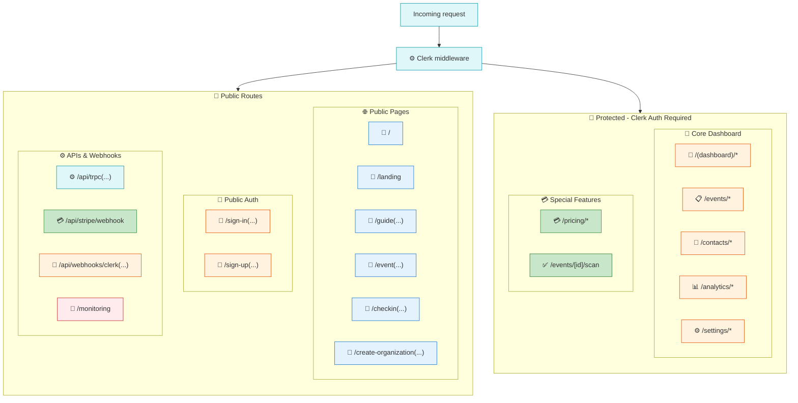
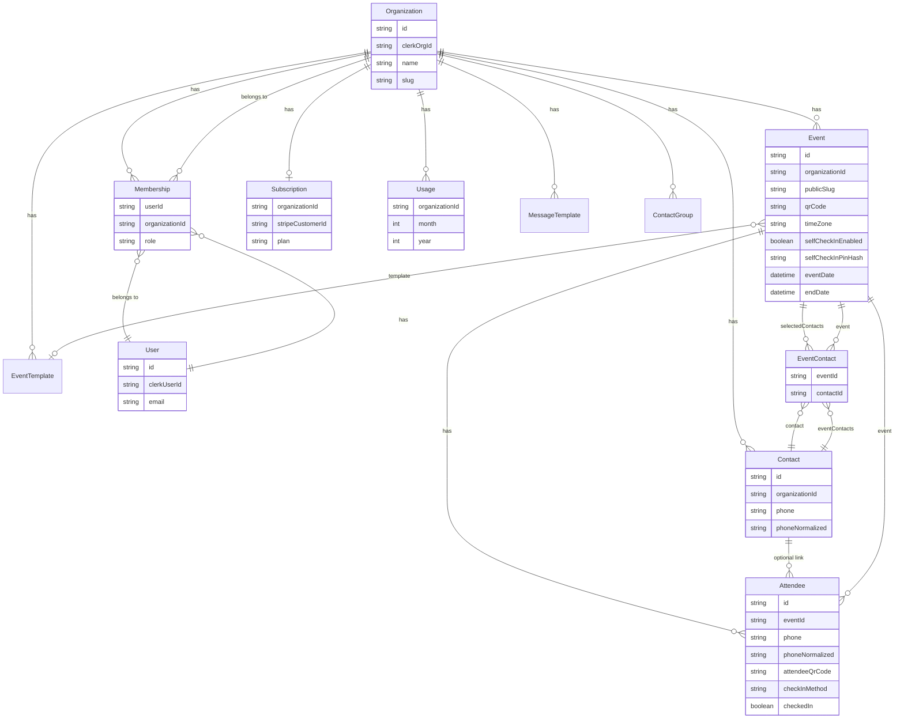
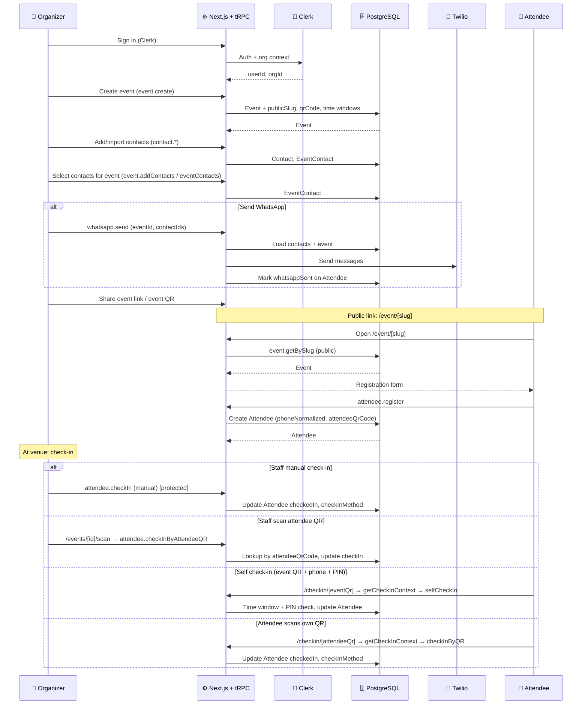
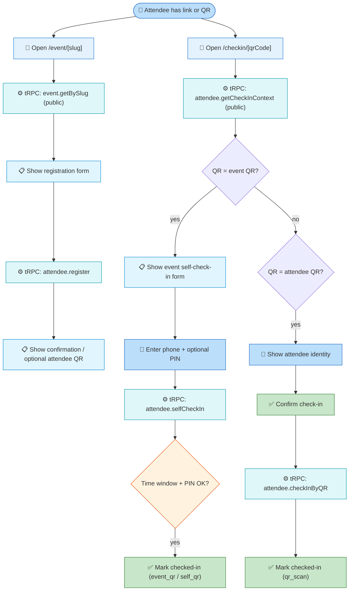
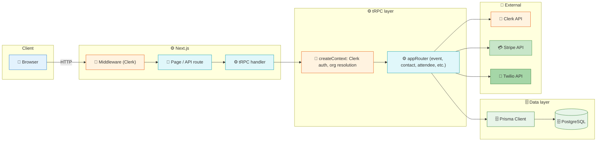

# Lexnify Event-Org SaaS — High-Level Design

This document describes the system context, route model, data model, main workflows, and data flow for developers.

### Design legend (icons & colors)

Icons and colors are used consistently across all diagrams:

| Icon | Meaning                   | Color (fill)            | Use                               |
| ---- | ------------------------- | ----------------------- | --------------------------------- |
| 👤   | Organizer / User / People | `#E3F2FD` (light blue)  | Organizer, User, auth context     |
| 👥   | Attendee / Audience       | `#BBDEFB` (blue)        | Attendee, public users            |
| 🔐   | Auth / Protected          | `#FFF3E0` (amber)       | Clerk, protected routes, security |
| ⚙️   | App / Backend             | `#E0F7FA` (cyan)        | Next.js, tRPC, middleware         |
| 🗄️   | Data / Database           | `#E8F5E9` (green)       | PostgreSQL, Prisma, DB            |
| 💳   | Billing                   | `#C8E6C9` (light green) | Stripe, subscription              |
| 💬   | Messaging                 | `#A5D6A7` (green)       | Twilio, WhatsApp                  |
| 🔌   | External service          | `#F3E5F5` (purple)      | Cloudinary, external APIs         |
| 📡   | Monitoring                | `#FFEBEE` (light red)   | Sentry                            |
| 📄   | Public / Route            | `#E3F2FD` (light blue)  | Public routes, pages              |
| ✅   | Check-in / Success        | `#C8E6C9` (green)       | Check-in, success states          |
| 📋   | Event / Entity            | `#E1F5FE` (cyan)        | Event, entity                     |
| 📇   | Contact                   | `#E1F5FE` (cyan)        | Contacts, address book            |
| 📊   | Analytics                 | `#FFF3E0` (amber)       | Analytics, reports                |

---

## 1. System context

- **Organizers** use the dashboard (protected); **attendees** use public event and check-in pages.
- All API calls from the app go through **Next.js**; authenticated and org-scoped logic uses **tRPC** with **Clerk** in context.
- **Stripe** and **Clerk** webhooks hit public Next.js API routes; **Twilio** is used from tRPC for WhatsApp.

---

## 2. Route classification (public vs protected)

- **Public**: No auth; used for landing, guide, event page, check-in, sign-in/up, create-org, tRPC (procedure-level auth), Stripe/Clerk webhooks, Sentry monitoring.
- **Protected**: Clerk `userId` required; unauthenticated users are redirected to `/sign-in` with `redirect_url`.

---

## 3. Core data model

Entity colors (conceptually): 🏢 Organization (purple), 👤 User (blue), 📋 Event (cyan), 👥 Attendee (blue), 📇 Contact (cyan), 💳 Subscription (green), 🗄️ Usage (green). Junction tables (e.g. Membership, EventContact) link entities.

- **Organization** is the tenant; synced with Clerk via `clerkOrgId`. **User** and **Membership** tie Clerk users to orgs and roles.
- **Event** has a unique `publicSlug` and optional `qrCode` for event-level check-in; **Attendee** has optional `attendeeQrCode` and `checkInMethod` (e.g. `qr_scan`, `manual`, `event_qr`, `self_qr`).
- **Contact** is org-scoped; **EventContact** links contacts to events (selected contacts for an event). **Attendee** can optionally reference a **Contact**.
- **Subscription** and **Usage** are org-scoped for billing and limits.

---

## 4. Organizer workflow (event → invite → check-in)

- Organizer is always in **org context** (Clerk + tRPC `ctx.organizationId`).
- Event has **time windows** (registration open/close, check-in open/close) and optional **self-check-in** with venue PIN; all check-in paths are idempotent where applicable.

---

## 5. Attendee workflow (public event + check-in)

- **getCheckInContext** returns whether the QR is an event or attendee and whether self-check-in and PIN are required.
- **selfCheckIn** is used when the attendee opens the event QR and enters phone (and PIN if enabled); **checkInByQR** is used when the attendee scans their own attendee QR (or staff scans it at `/events/[id]/scan`).

---

## 6. Data flow (request path)

- **Browser** → **Middleware**: public routes pass through; protected routes require Clerk `userId` or redirect to sign-in.
- **tRPC**: Context loads user and active organization (e.g. from header or query); **protectedProcedure** enforces auth and org; **publicProcedure** is used for event.getBySlug, attendee.register, getCheckInContext, checkInByQR, selfCheckIn.
- **Routers** perform business logic and use **Prisma** for all DB access; external calls (Clerk, Stripe, Twilio) are used from procedures or server-side code.

---

## 7. tRPC router overview

| Router          | Purpose                                                                                                                              |
| --------------- | ------------------------------------------------------------------------------------------------------------------------------------ |
| event           | CRUD events, getBySlug (public), time windows, self-check-in PIN, addContacts                                                        |
| contact         | CRUD contacts (org-scoped), import                                                                                                   |
| attendee        | register (public), getCheckInContext (public), checkInByQR (public), selfCheckIn (public), checkIn / checkInByAttendeeQR (protected) |
| organization    | getMyOrganizations, getCurrent, switch, create, update                                                                               |
| subscription    | get, getUsage (Stripe-backed)                                                                                                        |
| usage           | getCurrent (org usage)                                                                                                               |
| whatsapp        | send (Twilio)                                                                                                                        |
| ai              | Social posts, copy, suggestions (tokens tracked)                                                                                     |
| analytics       | getSummary, event/org analytics                                                                                                      |
| template        | Event templates CRUD                                                                                                                 |
| export          | Export attendees/contacts                                                                                                            |
| group           | Contact groups CRUD                                                                                                                  |
| messageTemplate | WhatsApp message templates CRUD                                                                                                      |

---

## 8. Key files reference

| Area                | Path                         |
| ------------------- | ---------------------------- |
| Auth & routes       | `middleware.ts`              |
| tRPC app router     | `server/routers/_app.ts`     |
| tRPC context        | `lib/trpc.ts`                |
| Schema              | `prisma/schema.prisma`       |
| Event time windows  | `lib/event-schedule.ts`      |
| Phone normalization | `lib/phone.ts`               |
| Venue PIN           | `lib/venue-pin.ts`           |
| Public event page   | `app/event/[slug]/...`       |
| Public check-in     | `app/checkin/[qrCode]/...`   |
| Staff scanner       | `app/events/[id]/scan/...`   |
| Dashboard layout    | `app/(dashboard)/layout.tsx` |

This high-level design should stay in sync with the codebase; when adding new routers, public/protected routes, or entities, update this document and the diagrams accordingly.
